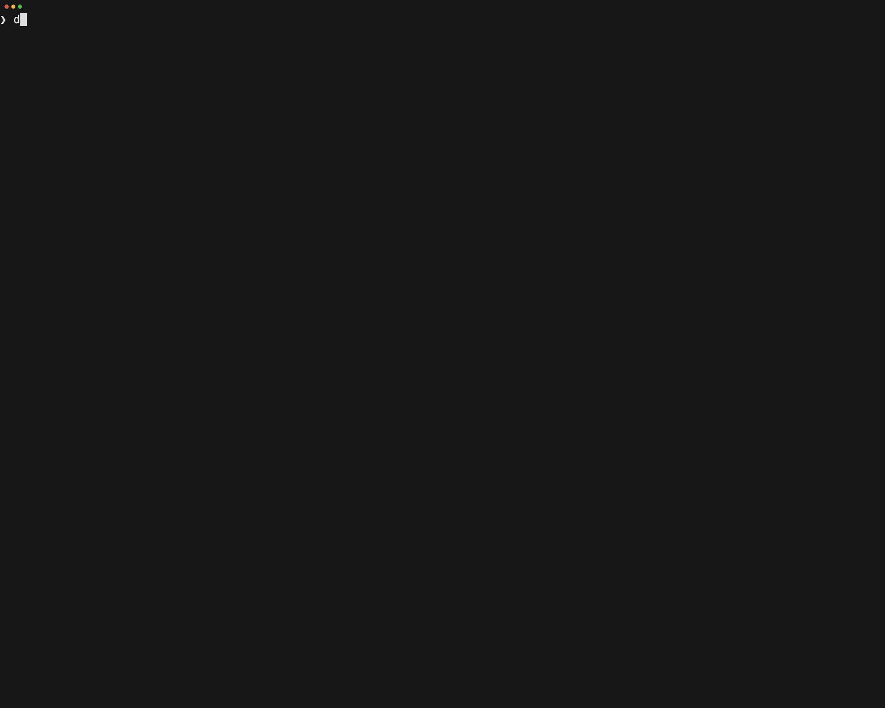

# 🤖 Docker `cagent` 🤖

> Build, run, and share AI agents with a declarative YAML config, rich tool ecosystem, and multi-agent orchestration.



## What is Docker `cagent`?

Docker `cagent` lets you create and run intelligent AI agents that collaborate to solve complex problems — no code required. Define agents in YAML, give them tools, and let them work.

```yaml
agents:
  root:
    model: openai/gpt-5-mini
    description: A helpful AI assistant
    instruction: |
      You are a knowledgeable assistant that helps users with various tasks.
      Be helpful, accurate, and concise in your responses.
    toolsets:
      - type: mcp
        ref: docker:duckduckgo
```

```sh
cagent run agent.yaml
```

## Key Features

- **Multi-agent architecture** — Create teams of specialized agents that delegate tasks automatically
- **Rich tool ecosystem** — Built-in tools + any [MCP](https://modelcontextprotocol.io/) server (local, remote, or Docker-based)
- **AI provider agnostic** — OpenAI, Anthropic, Gemini, AWS Bedrock, Mistral, xAI, [Docker Model Runner](https://docs.docker.com/ai/model-runner/), and more
- **YAML configuration** — Declarative, versionable, shareable
- **Advanced reasoning** — Built-in think, todo, and memory tools
- **RAG** — Pluggable retrieval with BM25, embeddings, hybrid search, and reranking
- **Package & share** — Push agents to any OCI registry, pull and run them anywhere

## Install

**Docker Desktop** (4.49+) — cagent is pre-installed. Just run `cagent`.

**Homebrew** — `brew install cagent`

**Binary releases** — Download from [GitHub Releases](https://github.com/docker/cagent/releases).

Set at least one API key (or use [Docker Model Runner](https://docs.docker.com/ai/model-runner/) for local models):

```sh
export OPENAI_API_KEY=sk-...        # or ANTHROPIC_API_KEY, GOOGLE_API_KEY, etc.
```

## Quick Start

```sh
# Run the default agent
cagent run

# Run from the agent catalog
cagent run agentcatalog/pirate

# Generate a new agent interactively
cagent new

# Run your own config
cagent run agent.yaml
```

More examples in the [`examples/`](examples/README.md) directory.

## Documentation

📖 **[Full documentation](https://docker.github.io/cagent/)**

- [Installation](https://docker.github.io/cagent/#getting-started/installation) · [Quick Start](https://docker.github.io/cagent/#getting-started/quickstart)
- [Agents](https://docker.github.io/cagent/#concepts/agents) · [Models](https://docker.github.io/cagent/#concepts/models) · [Tools](https://docker.github.io/cagent/#concepts/tools) · [Multi-Agent](https://docker.github.io/cagent/#concepts/multi-agent)
- [Configuration Reference](https://docker.github.io/cagent/#configuration/overview)
- [TUI](https://docker.github.io/cagent/#features/tui) · [CLI](https://docker.github.io/cagent/#features/cli) · [MCP Mode](https://docker.github.io/cagent/#features/mcp-mode) · [RAG](https://docker.github.io/cagent/#features/rag)
- [Model Providers](https://docker.github.io/cagent/#providers/overview) · [Docker Model Runner](https://docker.github.io/cagent/#providers/dmr)

## Contributing

Read the [Contributing guide](https://docker.github.io/cagent/#community/contributing) to get started. We use `cagent` to build `cagent`:

```sh
cagent run ./golang_developer.yaml
```

## Telemetry

We collect anonymous usage data to improve the tool. See [Telemetry](https://docker.github.io/cagent/#community/telemetry).

## Community

[Docker Community Slack](http://dockr.ly/comm-slack) · [#cagent channel](https://dockercommunity.slack.com/archives/C09DASHHRU4)
