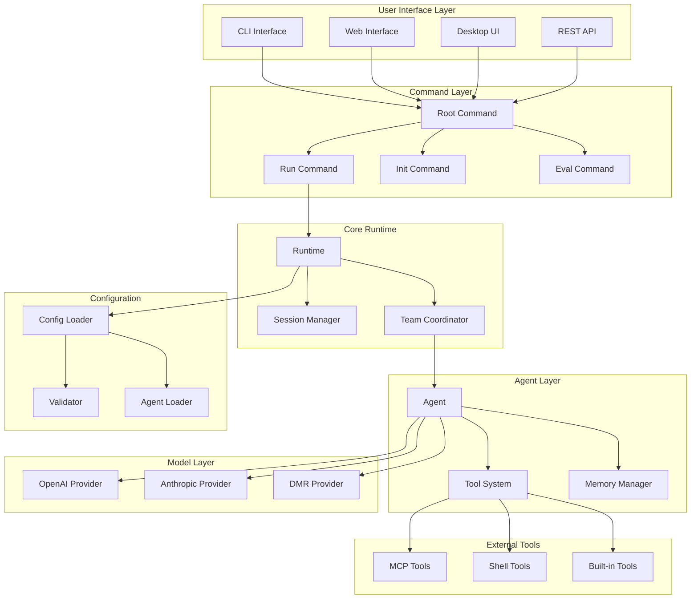
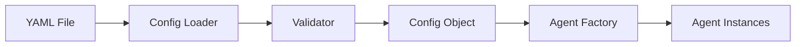
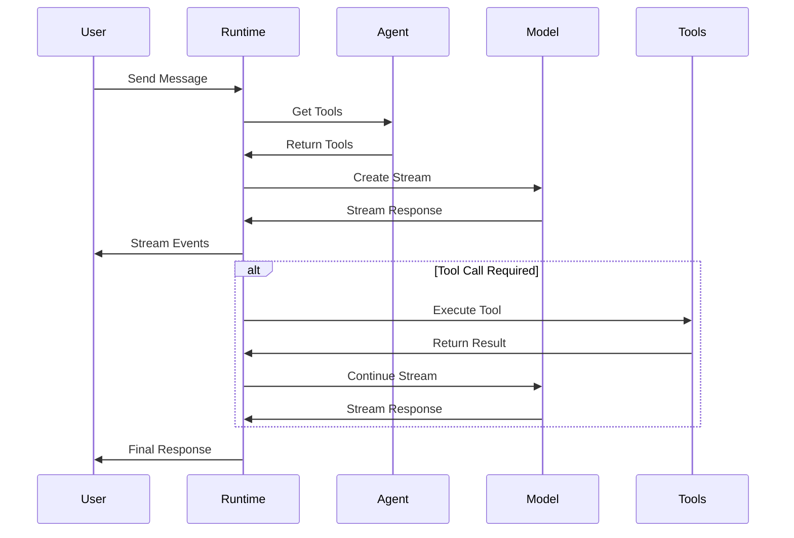
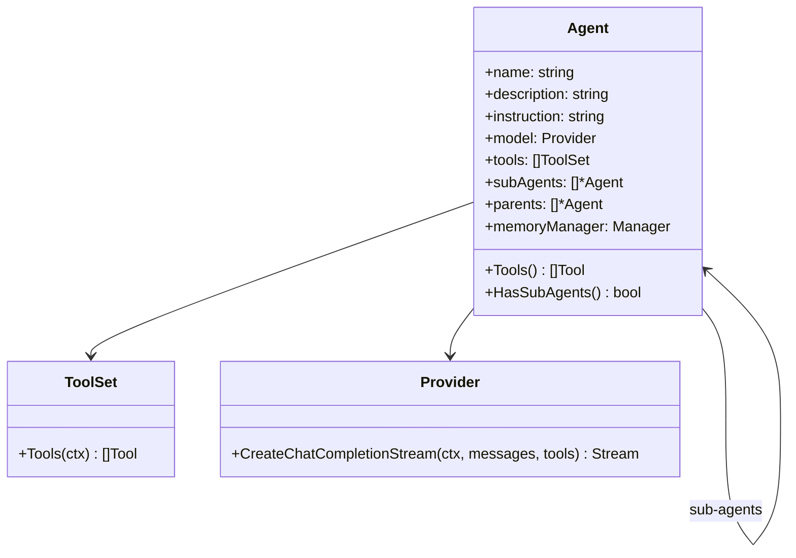
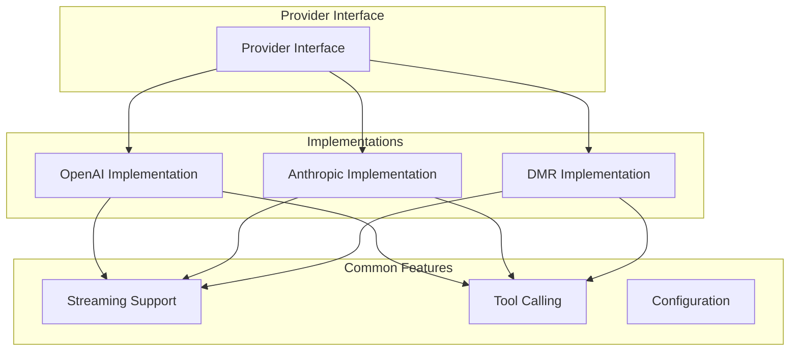
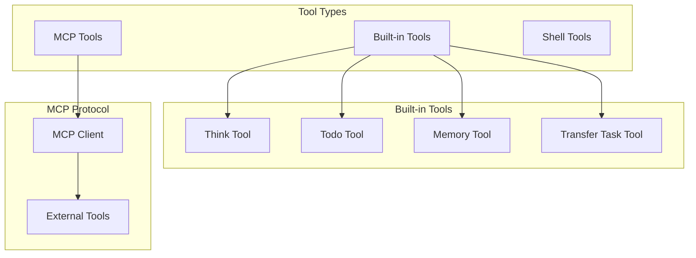
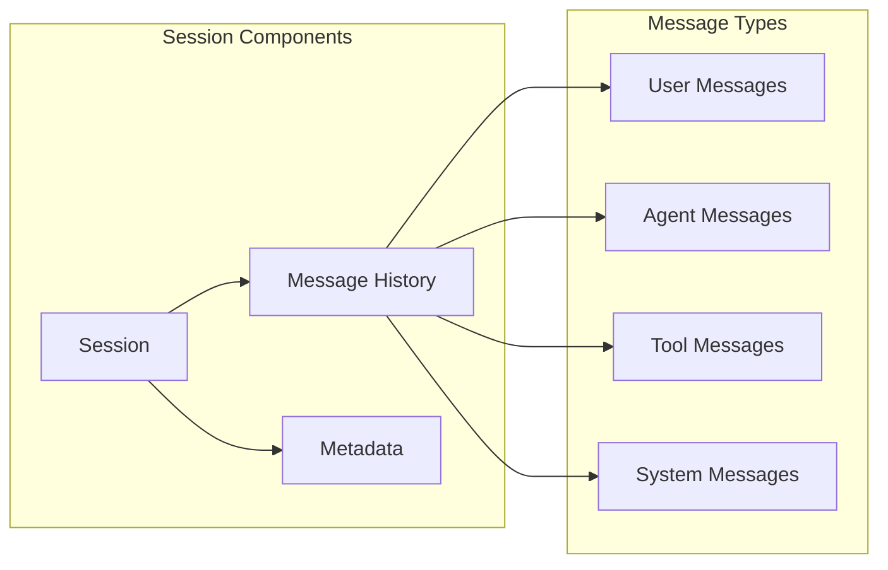
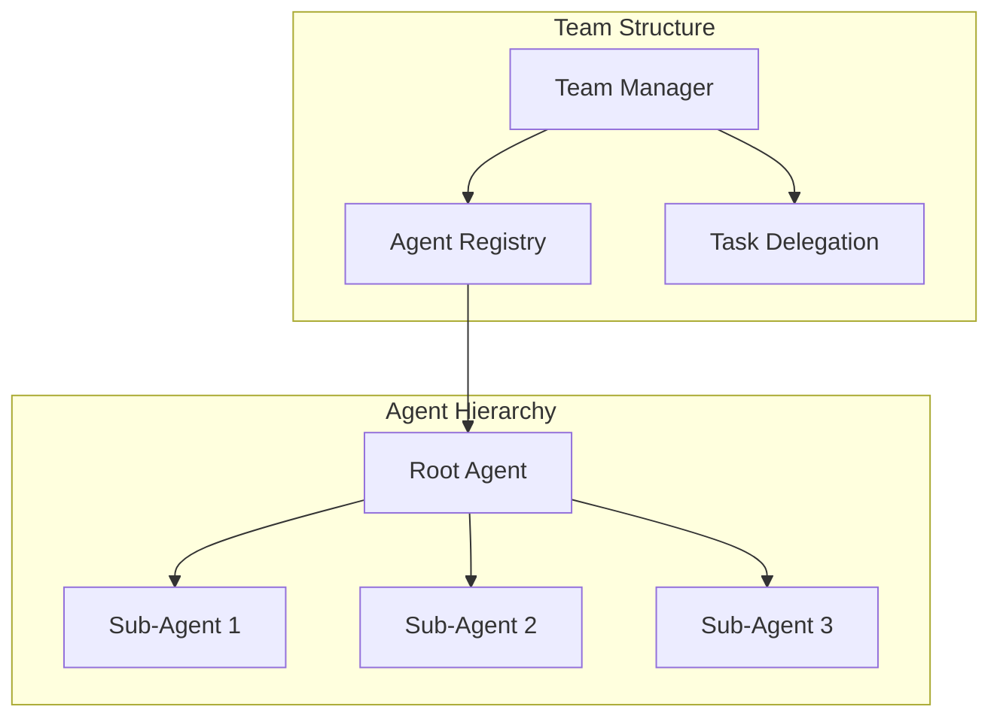
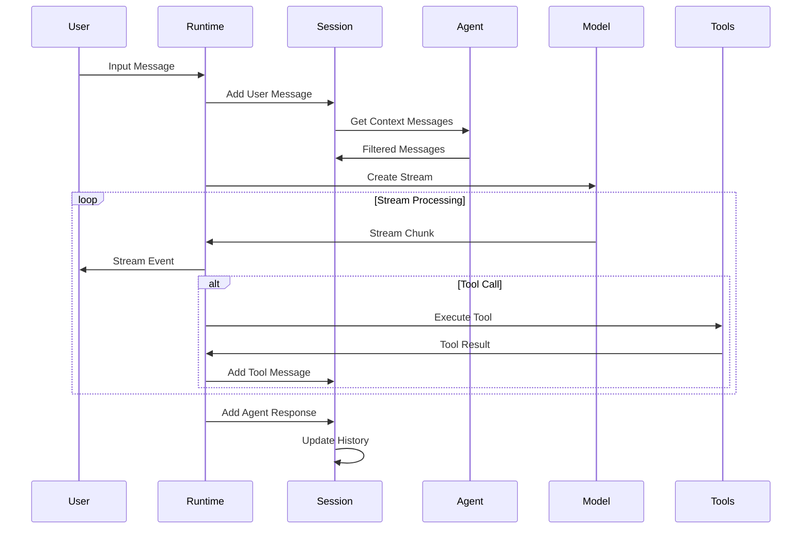
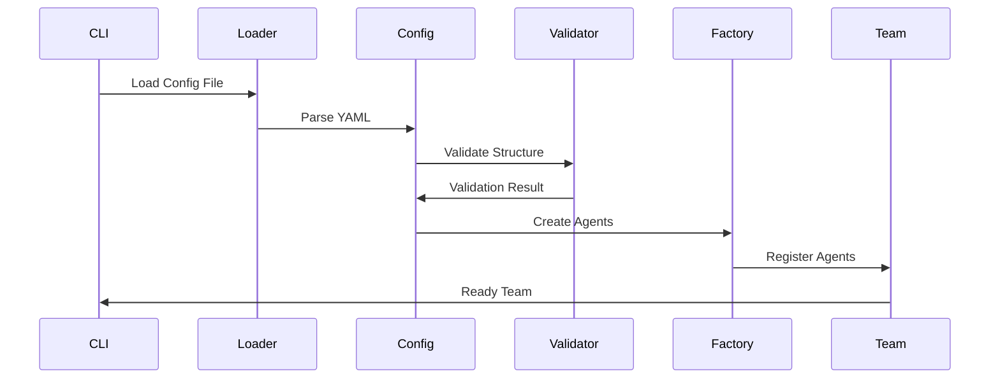

# Architecture Guide

This guide explains the internal architecture of cagent, how components
interact, and the design principles behind the system.

## System Overview

cagent is built as a modular, event-driven multi-agent system with the following
key characteristics:

- **Hierarchical Agent Structure**: Agents can have sub-agents for specialized
  tasks
- **Event-Driven Runtime**: Streaming architecture for real-time interactions
- **Pluggable Tools**: Extensible tool system via Model Context Protocol (MCP)
- **Provider Agnostic**: Support for multiple AI providers
- **Configuration-Driven**: YAML-based declarative configuration

## Architecture Diagram



## Component Architecture

### 1. Command Layer (`cmd/root/`)

The command layer provides multiple interfaces for interacting with cagent:

#### Root Command (`root.go`)

- Entry point for all CLI operations
- Manages global flags and configuration
- Dispatches to appropriate subcommands

#### Run Command (`run.go`)

- Interactive chat interface
- Handles user input and agent responses
- Manages conversation flow and session state

#### Web Interface (`web.go`)

- HTTP server for web-based interactions
- RESTful API endpoints
- WebSocket support for real-time communication

#### TUI Command (`tui.go`)

- Desktop application interface
- Native GUI components
- Cross-platform compatibility

### 2. Configuration System (`pkg/config/`)

The configuration system handles agent and model definitions:



#### Configuration Loading Flow

1. **Parse YAML**: Load and parse configuration file
2. **Validate Structure**: Check syntax and required fields
3. **Cross-Reference**: Ensure all references are valid
4. **Create Objects**: Instantiate agents and models

### 3. Runtime System (`pkg/runtime/`)

The runtime system is the core execution engine:



#### Key Components

**Runtime Engine** (`runtime.go`):

- Manages agent lifecycle
- Handles streaming responses
- Coordinates tool execution
- Manages task delegation

**Event System**:

- Real-time streaming architecture
- Multiple event types for different actions
- Asynchronous processing

**Tool Integration**:

- Dynamic tool discovery
- Tool call parsing and execution
- Error handling and recovery

### 4. Agent System (`pkg/agent/`)

Agents are the core abstraction in cagent:



#### Agent Lifecycle

1. **Creation**: Agent instantiated from configuration
2. **Initialization**: Tools and sub-agents connected
3. **Execution**: Processing messages and tool calls
4. **Delegation**: Task transfer to sub-agents
5. **Cleanup**: Resource cleanup and state persistence

### 5. Model Integration (`pkg/model/`)

The model layer abstracts different AI providers:



#### Provider Interface

All providers implement a common interface:

- `CreateChatCompletionStream()`: Stream-based chat completion
- Model-specific configuration handling
- Tool call support
- Error handling and retry logic

### 6. Tool System (`pkg/tools/`)

The tool system provides extensible capabilities:



#### Tool Execution Flow

1. **Discovery**: Agent discovers available tools
2. **Registration**: Tools registered with runtime
3. **Invocation**: Model decides to call tool
4. **Execution**: Tool handler processes request
5. **Response**: Result returned to model

### 7. Session Management (`pkg/session/`)

Session management handles conversation state:



#### Session Features

- **Message History**: Complete conversation tracking
- **Agent Context**: Per-agent message filtering
- **Persistence**: Session state can be saved/loaded
- **Metadata**: Additional context and configuration

### 8. Team Coordination (`pkg/team/`)

The team system manages multi-agent coordination:



#### Delegation Flow

1. **Task Analysis**: Root agent analyzes incoming task
2. **Agent Selection**: Identifies best sub-agent for task
3. **Context Transfer**: Passes relevant context
4. **Execution**: Sub-agent processes task
5. **Result Integration**: Results merged back to main conversation

## Data Flow

### Message Processing Flow



### Configuration Loading Flow



## Design Principles

### 1. Modularity

- Each component has a single responsibility
- Clear interfaces between components
- Pluggable architecture for extensibility

### 2. Event-Driven Architecture

- Streaming responses for real-time interaction
- Asynchronous processing where possible
- Event-based communication between components

### 3. Configuration-Driven

- Declarative agent and model definitions
- No hard-coded behaviors
- Easy to modify and extend

### 4. Provider Agnostic

- Abstract interface for AI providers
- Consistent behavior across providers
- Easy to add new providers

### 5. Tool Extensibility

- Standard tool interface
- Support for external tools via MCP
- Built-in tools for common operations

## Performance Considerations

### 1. Streaming Architecture

- Reduces latency for user interactions
- Enables real-time progress feedback
- Efficient memory usage

### 2. Lazy Loading

- Agents created only when needed
- Tools loaded on demand
- Configuration validated incrementally

### 3. Resource Management

- Proper cleanup of resources
- Connection pooling for providers
- Memory management for large conversations

### 4. Concurrent Processing

- Multiple agents can run concurrently
- Tool calls executed asynchronously
- Efficient context switching

## Security Considerations

### 1. API Key Management

- Environment variable usage
- No hardcoded credentials
- Secure key rotation support

### 2. Tool Permissions

- Granular tool access control
- Filesystem permission restrictions
- Shell command filtering

### 3. Input Validation

- Configuration validation
- User input sanitization
- Tool parameter validation

### 4. Audit Logging

- Complete action logging
- Debug information capture
- Error tracking and reporting

## Extension Points

### 1. Custom Providers

Implement the `Provider` interface to add new AI providers:

```go
type Provider interface {
    CreateChatCompletionStream(ctx context.Context, messages []Message, tools []Tool) (Stream, error)
}
```

### 2. Custom Tools

Create new tools by implementing the `Tool` interface:

```go
type Tool interface {
    Function() Function
    Handler(ctx context.Context, call ToolCall) (*ToolCallResult, error)
}
```

### 3. Custom Memory Managers

Implement custom memory strategies:

```go
type Manager interface {
    Store(ctx context.Context, key string, value interface{}) error
    Retrieve(ctx context.Context, key string) (interface{}, error)
}
```

### 4. Custom UI Components

Add new interfaces by implementing command handlers:

```go
func NewCustomCmd() *cobra.Command {
    return &cobra.Command{
        Use: "custom",
        RunE: customCommandHandler,
    }
}
```

This architecture provides a solid foundation for building sophisticated
multi-agent systems while maintaining flexibility and extensibility.
