# Architecture Guide

This guide explains the internal architecture of `cagent`, how components
interact, and the design principles behind the system.

## System Overview

`cagent` is built as a modular, event-driven multi-agent system with the following
key characteristics:

- **Multi-tenant Architecture**: ServiceCore layer provides client isolation for MCP and HTTP transports
- **Transport-Agnostic Design**: Core business logic separated from MCP/HTTP transport concerns
- **Hierarchical Agent Structure**: Agents can have sub-agents with task delegation via transfer_task tool
- **Event-Driven Runtime**: Streaming architecture for real-time interactions
- **Pluggable Tools**: Extensible tool system with built-in tools and MCP integration
- **Provider Agnostic**: Support for multiple AI providers (OpenAI, Anthropic, Gemini, DMR)
- **Security-First**: Client-scoped operations with proper resource isolation
- **Agent Store System**: Support for both file-based and Docker registry-based agent distribution

## Architecture Diagram

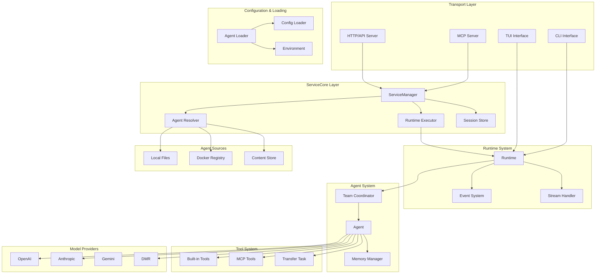

## Component Architecture

### 1. Transport Layer (`cmd/root/`)

The transport layer provides multiple interfaces for interacting with cagent:

#### CLI Interface (`cmd/root/run.go`)

- Direct agent execution for local development and testing
- Interactive chat interface with streaming responses
- Session commands: /exit, /eval, /reset
- Support for both file-based and store-based agentsF

#### TUI Interface (`cmd/root/tui.go`)

- Terminal user interface for interactive agent sessions
- Local agent execution with enhanced UX

#### ServiceManager Interface

- **Client Management**: CreateClient, RemoveClient with proper isolation
- **Agent Operations**: ResolveAgent, ListAgents, PullAgent with security boundaries
- **Session Management**: CreateAgentSession, SendMessage, ListSessions, CloseSession
- **Advanced Operations**: GetSessionHistory, GetSessionInfo with client scoping

#### Multi-Tenant Design

- All operations require clientID for proper isolation
- Agent resolution restricted to configured root directories
- Session limits and timeout enforcement per client
- Resource cleanup on client disconnect
- Security-first design preventing cross-client access

### 3. Runtime System (`pkg/runtime/`)

The runtime system is the core execution engine with event-driven architecture:

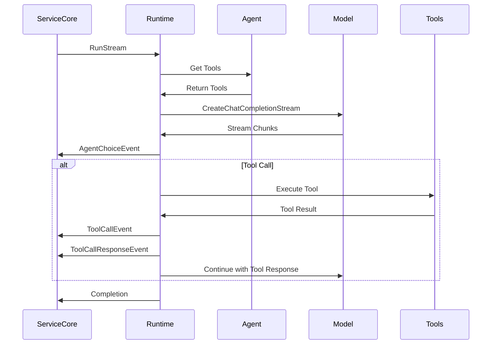

#### Key Components

**Runtime Engine** (`runtime.go`):

- Event-driven streaming with RunStream method
- Team coordination with transfer_task tool handler
- Built-in tool registration (transfer_task)
- Agent tool integration and execution
- Session message management

**Event System** (`event.go`):

- AgentChoiceEvent: Real-time content streaming
- ToolCallEvent: Tool invocation notifications
- ToolCallResponseEvent: Tool execution results
- ErrorEvent: Error handling and propagation
- AgentMessageEvent: Agent communication events

**Tool Integration**:

- Runtime-level tools (transfer_task for delegation)
- Agent-level tools from ToolSets
- MCP tool integration via toolsets
- Built-in tools (think, todo, memory, filesystem, shell)

### 4. Agent System (`pkg/agent/`)

Agents are the core abstraction in cagent with hierarchical structure:

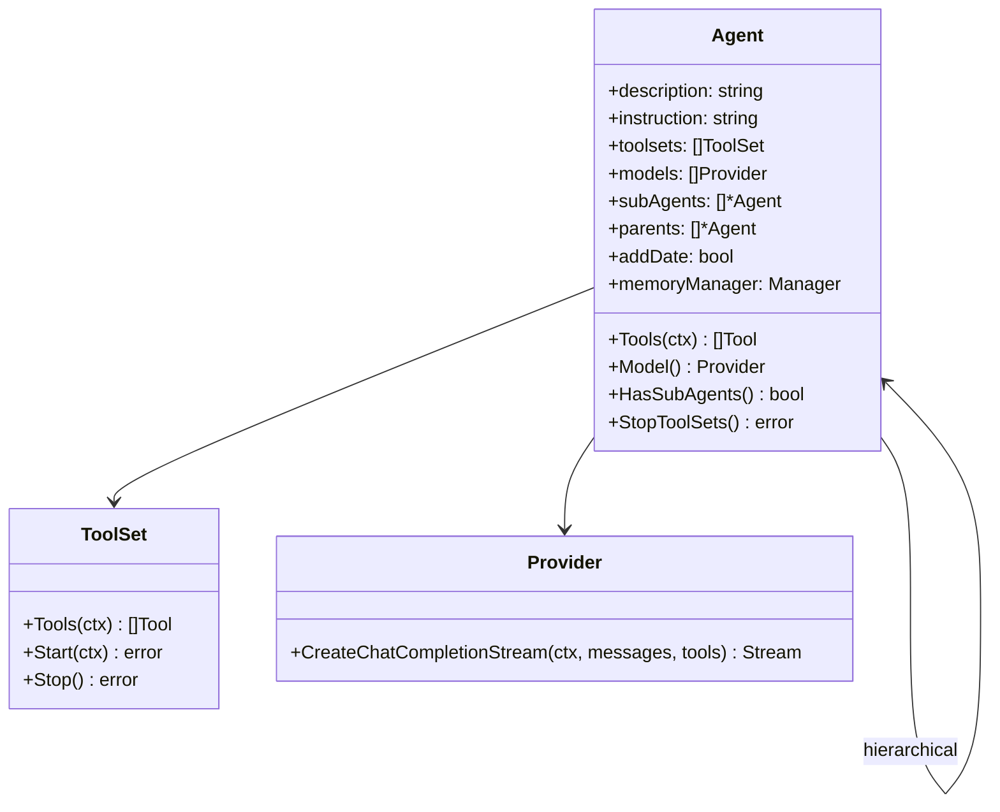

#### Agent Features

**Core Properties**:
- Name, description, instruction for agent behavior
- Multi-Model support with random selection
- Hierarchical sub-agent relationships
- Date injection capability (addDate)
- Memory manager integration

**Tool Management**:
- ToolSet lifecycle with Start/Stop operations
- Lazy toolset initialization
- Tool aggregation from multiple sources
- Built-in tool wrapper integration

**Lifecycle Management**:
1. **Creation**: Agent instantiated from configuration
2. **Tool Initialization**: ToolSets started on first use
3. **Execution**: Processing messages and coordinating tools
4. **Delegation**: Task transfer via transfer_task tool
5. **Cleanup**: Proper ToolSet stopping and resource cleanup

### 5. Model Integration (`pkg/model/provider/`)

The model layer abstracts different AI providers with unified interface:

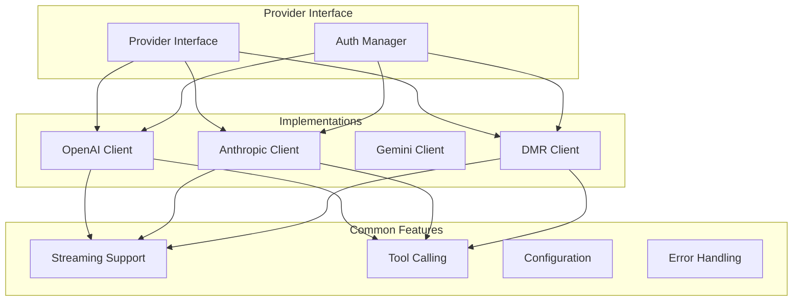

#### Provider Interface

All providers implement the common `Provider` interface:

- `CreateChatCompletionStream(ctx, messages, tools)`: Unified streaming interface
- Authentication handling via auth package
- Tool calling support across all providers
- Consistent error handling and retry logic
- Provider-specific configuration management

#### Supported Providers

- **OpenAI**: GPT models with function calling
- **Anthropic**: Claude models with tool use
- **DMR**: Custom model provider with streaming support

### 6. Tool System (`pkg/tools/`)

The tool system provides extensible capabilities through ToolSets:

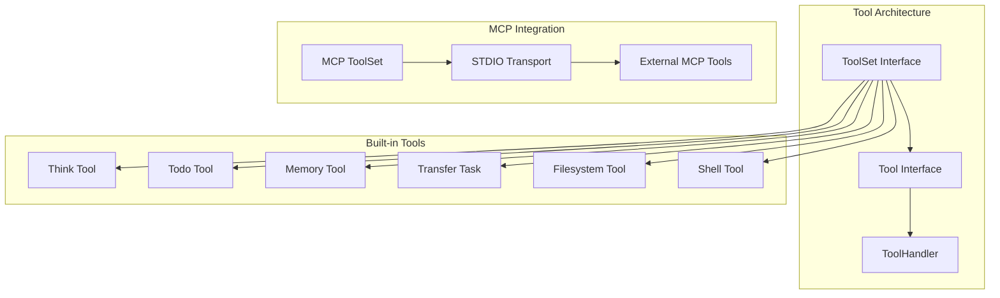

#### Tool Interface Design

```go
type Tool struct {
    Function *FunctionDefinition
    Handler  ToolHandler
}

type ToolSet interface {
    Tools(ctx context.Context) ([]Tool, error)
    Instructions() string
    Start(ctx context.Context) error
    Stop() error
}
```

#### Built-in Tools

- **Think Tool**: Internal reasoning and reflection
- **Todo Tool**: Task and goal management
- **Memory Tool**: Persistent information storage
- **Transfer Task Tool**: Agent delegation (handled by runtime)
- **Filesystem Tool**: File operations with security restrictions
- **Shell Tool**: System command execution

#### Tool Execution Flow

1. **ToolSet Lifecycle**: Start/Stop management
2. **Tool Discovery**: Agent aggregates tools from all ToolSets
3. **Model Invocation**: AI model decides to call tool
4. **Handler Execution**: Tool-specific logic processes request
5. **Response Integration**: Result returned to conversation flow

### 7. Session Management (`pkg/session/`)

Session management handles conversation state and message history:

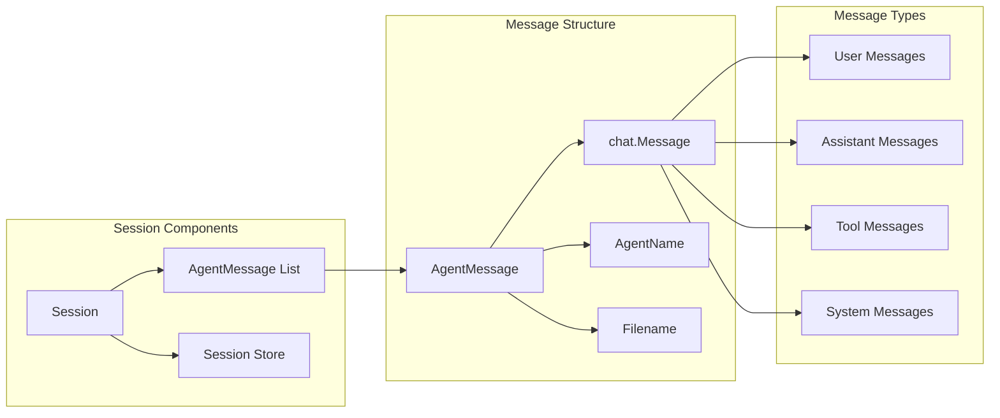

#### Session Features

- **AgentMessage Structure**: Links messages to specific agents and files
- **Message Filtering**: GetMessages(agent) for agent-specific context
- **Session Creation**: Configurable with initial user messages
- **Unique Identification**: UUID-based session IDs
- **Store Interface**: Pluggable persistence layer (SQLite implementation)
- **Multi-Agent Context**: Proper message attribution in team scenarios

### 8. Team Coordination (`pkg/team/`)

The team system manages multi-agent coordination and agent registry:

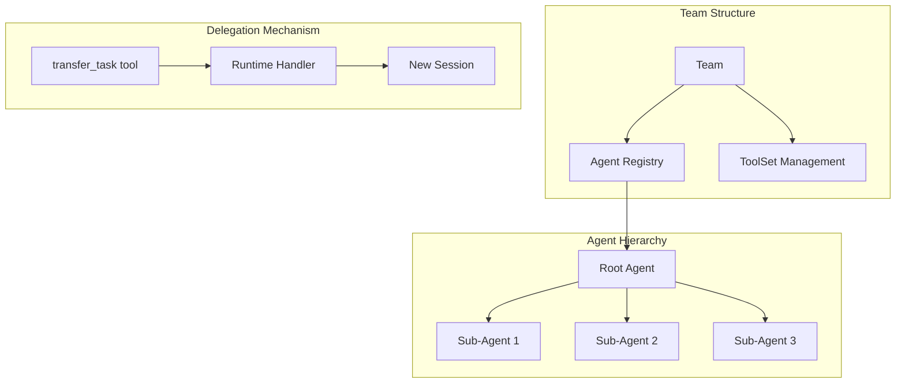

#### Team Operations

**Agent Registry**:
- `Get(name)`: Retrieve agent by name
- `Size()`: Get total agent count
- `StopToolSets()`: Cleanup all agent toolsets
- Agent lookup for transfer_task operations

**Delegation Flow** (via transfer_task):
1. **Task Transfer**: Runtime receives transfer_task call
2. **Agent Switch**: Runtime switches to target agent
3. **New Session**: Creates isolated session for sub-task
4. **Execution**: Sub-agent processes task independently
5. **Result Return**: Output merged back to main conversation
6. **Context Restore**: Runtime switches back to original agent

**Resource Management**:
- Proper toolset lifecycle management
- Agent cleanup on team destruction
- Memory manager coordination across agents

## Data Flow

### MCP Message Processing Flow

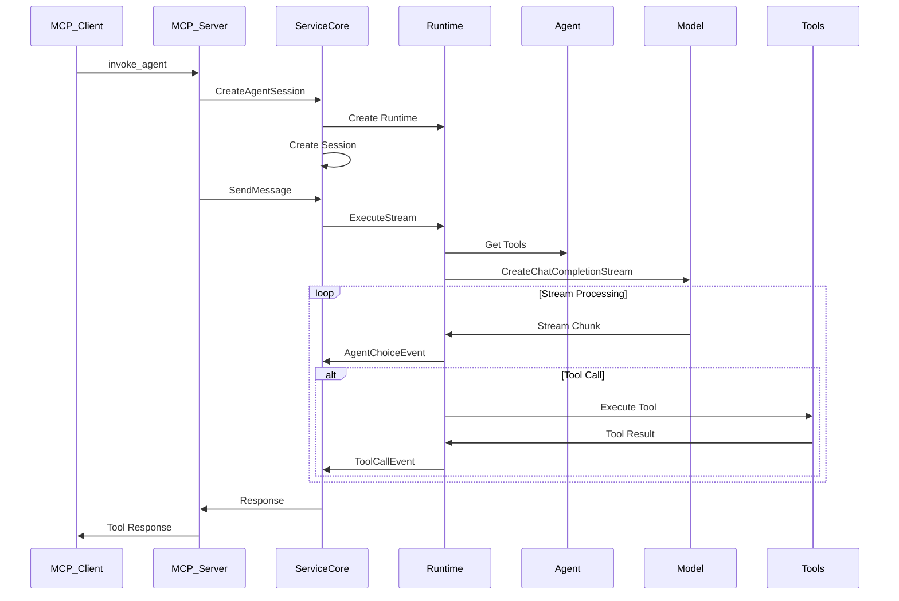

### CLI Message Processing Flow

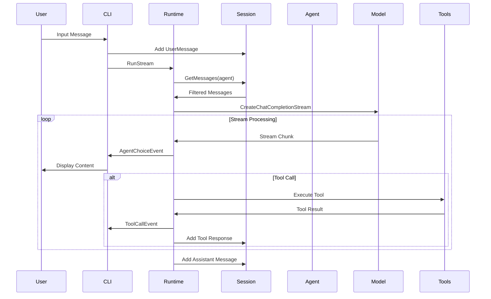

### Agent Resolution Flow

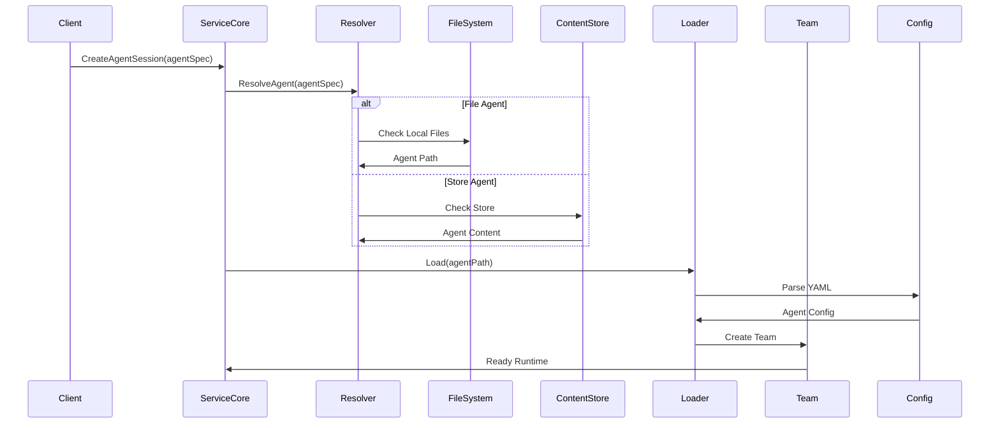

### Agent Store Flow

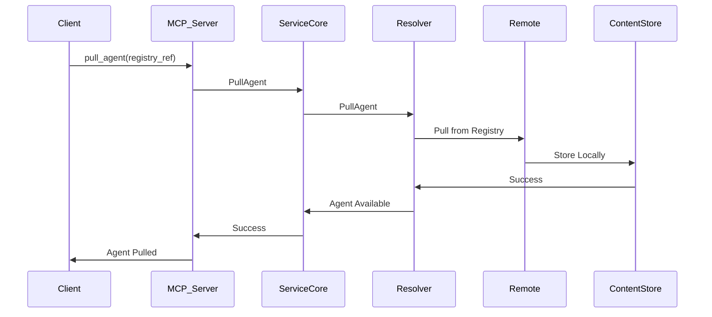

## Design Principles

### 1. Multi-Tenant Architecture

- Client isolation at the ServiceCore layer
- All operations scoped to specific clients
- Proper resource cleanup and session limits
- Security-first design preventing cross-client access

### 2. Transport-Agnostic Design

- Core business logic separated from transport concerns
- ServiceCore provides unified interface for MCP and HTTP
- Consistent behavior across different access methods
- Easy to add new transport layers

### 3. Event-Driven Architecture

- Streaming responses for real-time interaction
- Event types for different runtime phases
- Asynchronous tool execution
- Real-time progress feedback

### 4. Security-First Design

- Agent resolution restricted to configured directories
- Client-scoped operations with proper validation
- Resource limits and timeout enforcement
- Secure tool permissions and input validation

### 5. Hierarchical Agent System

- Agent-to-agent delegation via transfer_task
- Sub-agent specialization for complex tasks
- Context-aware task routing
- Proper task isolation and result integration

### 6. Pluggable Tool System

- ToolSet interface for extensible capabilities
- Built-in tools for common operations
- MCP integration for external tools
- Tool lifecycle management (Start/Stop)

### 7. Provider Agnostic Model Layer

- Unified Provider interface across AI models
- Consistent streaming and tool calling support
- Authentication abstraction
- Easy to add new AI providers

## Performance Considerations

### 1. Streaming Architecture

- Real-time event streaming reduces perceived latency
- Chunked response processing for immediate feedback
- Efficient memory usage with stream-based processing
- Non-blocking tool execution

### 2. Multi-Tenant Resource Management

- Client-isolated sessions prevent resource conflicts
- Session limits and timeout enforcement
- Proper runtime and toolset cleanup
- Memory-efficient agent loading

### 3. Lazy Initialization

- ToolSets started only when first used
- Agent resolution on-demand
- Configuration loading optimized for common cases
- MCP tool discovery as needed

### 4. Concurrent Processing

- Multiple client sessions can run simultaneously
- Tool calls executed asynchronously
- Event-driven architecture enables parallelism
- Efficient context switching between agents

### 5. Store-Based Agent Distribution

- Docker registry integration for agent sharing
- Local content store for caching
- Efficient agent packaging and distribution
- On-demand agent pulling

## Security Considerations

### 1. Multi-Tenant Isolation

- Client ID scoping for all operations
- Session isolation preventing cross-client access
- Resource limits per client
- Proper cleanup on client disconnect

### 2. Agent Resolution Security

- Restricted to configured root directories
- Path traversal prevention
- Secure agent specification parsing
- Registry authentication for agent pulling

### 3. Tool Security

- Filesystem tool restrictions to allowed directories
- Shell command execution controls
- MCP tool isolation and validation
- Tool parameter sanitization

### 4. Authentication & Authorization

- Environment-based credential management
- Provider-specific authentication handling
- No hardcoded secrets or keys
- Secure credential rotation support

### 5. Input Validation

- MCP tool parameter validation
- Configuration file validation
- Agent specification validation
- User input sanitization

### 6. Audit & Monitoring

- Comprehensive logging with client context
- Security event tracking
- Error monitoring and alerting
- Debug information for troubleshooting

## Extension Points

### 1. Custom AI Providers

Implement the `Provider` interface to add new AI providers:

```go
type Provider interface {
    CreateChatCompletionStream(ctx context.Context, messages []chat.Message, tools []tools.Tool) (chat.MessageStream, error)
}
```

### 2. Custom ToolSets

Create new toolsets by implementing the `ToolSet` interface:

```go
type ToolSet interface {
    Tools(ctx context.Context) ([]Tool, error)
    Instructions() string
    Start(ctx context.Context) error
    Stop() error
}
```

### 3. Custom Tools

Add individual tools with the `Tool` structure:

```go
type Tool struct {
    Function *FunctionDefinition
    Handler  ToolHandler
}

type ToolHandler func(ctx context.Context, toolCall ToolCall) (*ToolCallResult, error)
```

### 4. Custom Session Stores

Implement the `Store` interface for different persistence backends:

```go
type Store interface {
    CreateClient(ctx context.Context, clientID string) error
    DeleteClient(ctx context.Context, clientID string) error
    CreateSession(ctx context.Context, clientID string, session *AgentSession) error
    GetSession(ctx context.Context, clientID, sessionID string) (*AgentSession, error)
    // ... other session operations
}
```

### 5. Custom Transport Layers

Extend with new transport mechanisms by using ServiceCore:

```go
func NewCustomTransport(serviceCore servicecore.ServiceManager) *CustomTransport {
    return &CustomTransport{
        serviceCore: serviceCore,
    }
}
```

### 6. Custom Memory Managers

Implement custom memory strategies:

```go
type Manager interface {
    Store(ctx context.Context, key string, value interface{}) error
    Retrieve(ctx context.Context, key string) (interface{}, error)
}
```

### 7. Custom Agent Resolvers

Extend agent resolution with custom sources:

```go
type CustomResolver struct {
    // Custom resolution logic
}

func (r *CustomResolver) ResolveAgent(agentSpec string) (string, error) {
    // Custom agent resolution
}
```

## Current Implementation Status

### Fully Implemented

- ✅ **ServiceCore Layer**: Multi-tenant architecture with client isolation
- ✅ **MCP Server**: Full MCP protocol implementation with SSE transport
- ✅ **Runtime System**: Event-driven streaming with tool integration
- ✅ **Agent System**: Hierarchical agents with tool management
- ✅ **Tool System**: Built-in tools and MCP integration
- ✅ **Model Providers**: OpenAI, Anthropic, Gemini and DMR support
- ✅ **Session Management**: Conversation state and message history
- ✅ **Agent Store**: Docker registry integration for agent distribution
- ✅ **CLI Interface**: Direct agent execution and interaction
- ✅ **Configuration System**: YAML-based agent and model definitions

### Architecture Limitations

- **MCP Client Isolation**: Currently uses DEFAULT_CLIENT_ID for HTTP API compatibility
- **Session Persistence**: In-memory sessions in ServiceCore, SQLite store interface defined but not fully integrated
- **Tool Security**: Basic restrictions implemented, could be enhanced
- **Error Recovery**: Basic error handling, could be more sophisticated
- **Performance Monitoring**: Limited metrics and monitoring capabilities

### Notable Design Patterns

- **Transport-Agnostic**: ServiceCore cleanly separates business logic from transport
- **Event-Driven**: Real-time streaming across all interfaces
- **Security-First**: Client scoping and resource isolation
- **Extensible**: Plugin-like architecture for tools, providers, and transports
- **Resource Management**: Proper lifecycle management for agents and sessions

This architecture provides a solid foundation for building sophisticated multi-agent systems with enterprise-grade multi-tenancy, security, and extensibility while maintaining clean separation of concerns and consistent behavior across different access methods.
