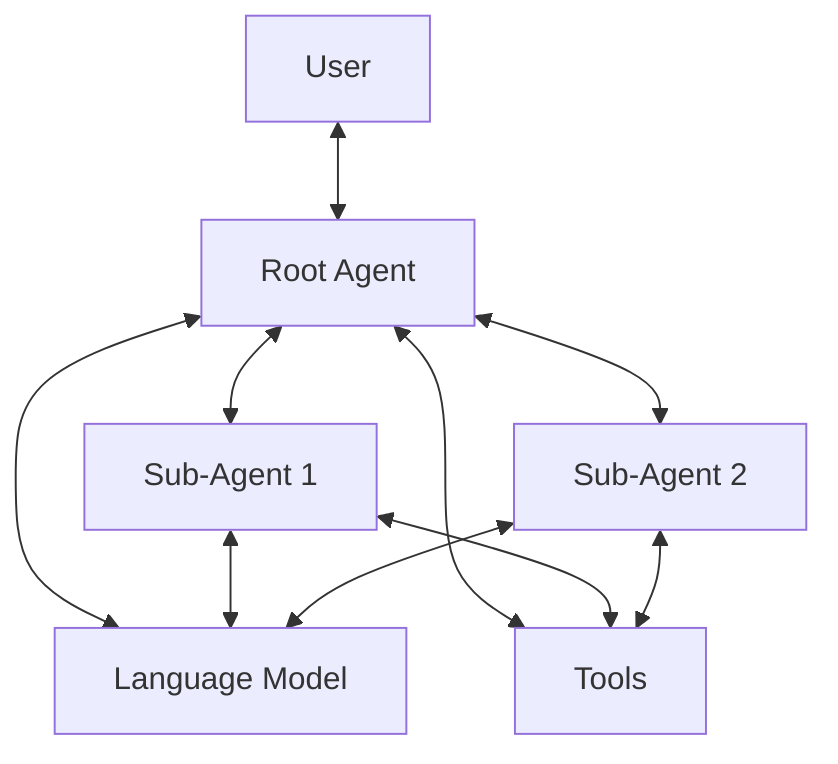
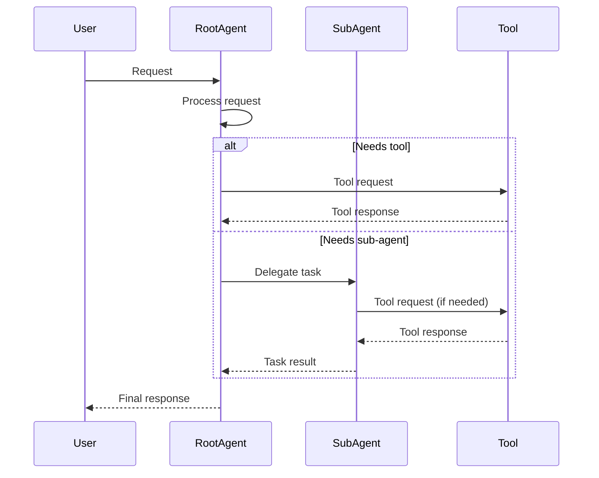
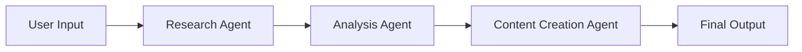

# Understanding Intelligent Agents

This document provides conceptual explanations of how intelligent agents work, the architecture behind them, and the key concepts that make them effective. This explanation will help you understand why agents are designed the way they are and how the various components work together.

## What is an Agent?

An intelligent agent is an autonomous system capable of observing its environment, making decisions, and taking actions to achieve specific goals. In our context, an agent is a software entity powered by a language model (LLM) that can:

1. Process user requests and natural language inputs
2. Access specialized tools to gather information or perform actions
3. Leverage sub-agents for specialized tasks
4. Generate responses based on its instructions and available information

## Core Architecture

The system architecture consists of these primary components:

### Root Agent

The root agent serves as the main entry point for user interactions. It:
- Receives and processes user queries
- Orchestrates the use of tools and sub-agents
- Maintains context throughout the conversation
- Formulates final responses to the user

### Language Models

Language models (LLMs) form the cognitive foundation of agents. They:
- Process natural language inputs
- Generate contextually appropriate responses
- Follow instructions defined in the agent configuration
- Understand when and how to use tools or delegate to sub-agents

### Sub-Agents

Sub-agents are specialized agents with focused capabilities. They:
- Handle specific types of tasks or domains
- Operate with their own instructions and context
- Report back to the parent agent
- Allow for modular system design and specialization

### Tools

Tools extend an agent's capabilities beyond language processing. They:
- Provide access to external systems (databases, APIs, etc.)
- Enable file operations, web searches, and other actions
- Allow agents to retrieve information not contained in their training data
- Execute commands in external environments

## Key Concepts

### Agent Configuration

Agent configuration defines an agent's behavior, capabilities, and limitations. The configuration:
- Sets the agent's personality and tone through instructions
- Determines which tools and sub-agents are available
- Specifies which language model powers the agent
- Establishes constraints on the agent's behavior

### Context Management

Agents maintain context throughout a conversation to provide coherent and relevant responses. This includes:
- User inputs and agent responses
- Information retrieved from tools
- Results from sub-agent interactions
- System messages and instructions

### Agent Instructions

Instructions are detailed directives that guide an agent's behavior. Well-crafted instructions:
- Define the agent's role and purpose
- Specify workflows for handling different scenarios
- Set behavioral guidelines and constraints
- Explain available tools and when to use them

### The Think Tool

The "think" tool represents a metacognitive ability for agents to:
- Reflect on complex problems before responding
- Break down multi-step reasoning processes
- Validate their understanding before taking action
- Maintain an internal dialogue to work through challenging tasks

## Mental Models for Understanding Agents

### Agents as Specialized Experts

Think of agents as specialized experts with different areas of knowledge and capabilities. The root agent acts as a coordinator who knows when to call in specific experts (sub-agents) for particular tasks.

### Tools as Extended Senses

Tools function as extended "senses" for agents, allowing them to perceive and interact with the world beyond their internal knowledge. Just as humans use tools to extend their natural capabilities, agents use tools to overcome their inherent limitations.

### Instruction as Training

Agent instructions are analogous to specialized training for a professional. They don't change the fundamental capabilities of the language model, but they focus those capabilities in specific ways and establish patterns of behavior.

## Design Principles

The agent system follows several key design principles:

### 1. Modularity

Agents are designed to be modular, with clearly defined responsibilities. This allows for:
- Easier maintenance and updates
- The ability to swap components without affecting the entire system
- Focused development of specialized capabilities

### 2. Separation of Concerns

Different aspects of functionality are separated:
- Language models handle natural language understanding and generation
- Tools handle specific actions and information retrieval
- Configuration files define behavior and capabilities
- Sub-agents handle specialized domains

### 3. Progressive Disclosure

The system follows a principle of progressive disclosure:
- Basic functionality is easy to configure and use
- Advanced capabilities are available when needed
- Complexity is hidden until required

### 4. Extensibility

The agent framework is designed to be extensible:
- New tools can be added to extend capabilities
- Custom sub-agents can be created for specialized domains
- Different language models can be integrated

## Communication Flow

The typical flow of communication in an agent system follows this pattern:

## System Limitations

Understanding the limitations of the agent system is important:

1. **Knowledge Cutoff**: Language models have a training cutoff date, after which they don't have native knowledge of events or information.

2. **Tool Dependency**: Agents can only interact with the world through their configured tools. If a necessary tool isn't available, the agent's capabilities are limited.

3. **Instruction Constraints**: An agent's effectiveness is highly dependent on the quality of its instructions. Poorly written or conflicting instructions will result in suboptimal performance.

4. **Resource Utilization**: More complex agent systems with multiple sub-agents and tools require more computational resources and may have higher latency.

## Advanced Concepts

### Chaining Multiple Agents

Complex workflows may involve multiple agents working in sequence or in parallel to solve a problem:

### Agent Specialization vs. Generalization

There's an inherent tradeoff between agent specialization and generalization:
- Specialized agents excel at specific tasks but have limited flexibility
- Generalist agents are more adaptable but may not perform as well on specialized tasks
- A well-designed system balances both approaches through appropriate use of sub-agents

### Tool Orchestration

Advanced agent configurations can orchestrate complex tool interactions:
- Sequential tool use (using the output of one tool as input to another)
- Conditional tool selection based on context
- Iterative tool use with refinement based on results

## Conclusion

Understanding the conceptual foundation of intelligent agents helps in designing effective agent systems. By grasping how agents, sub-agents, tools, and language models work together, you can create powerful, flexible, and maintainable agent configurations that effectively address your specific use cases.

For practical guidance on creating agents, refer to the [How-to Guide](./howto.md). For detailed configuration options, see the [Reference Documentation](./reference.md).